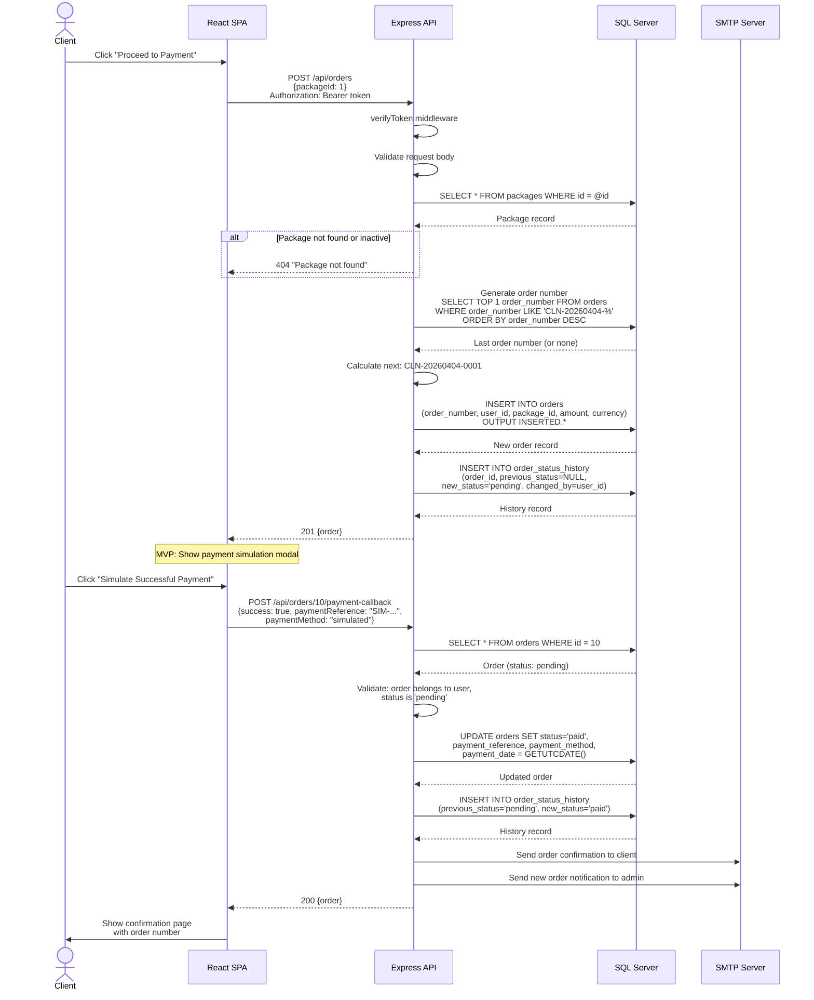
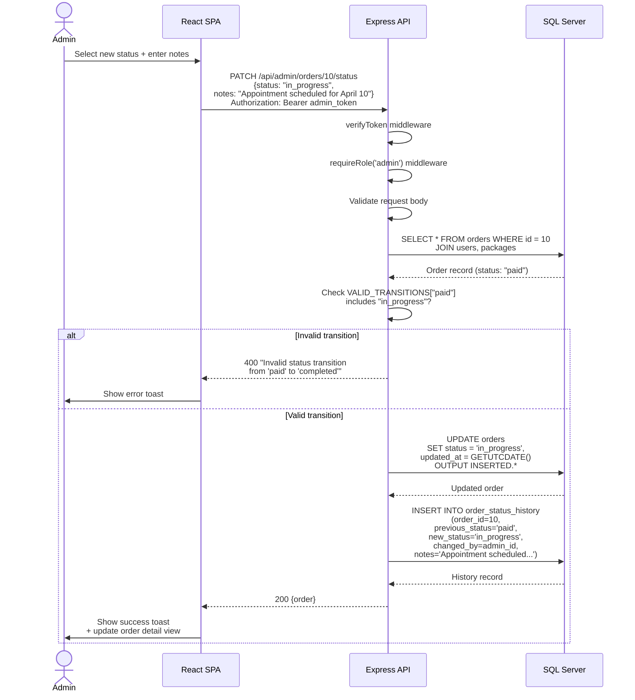
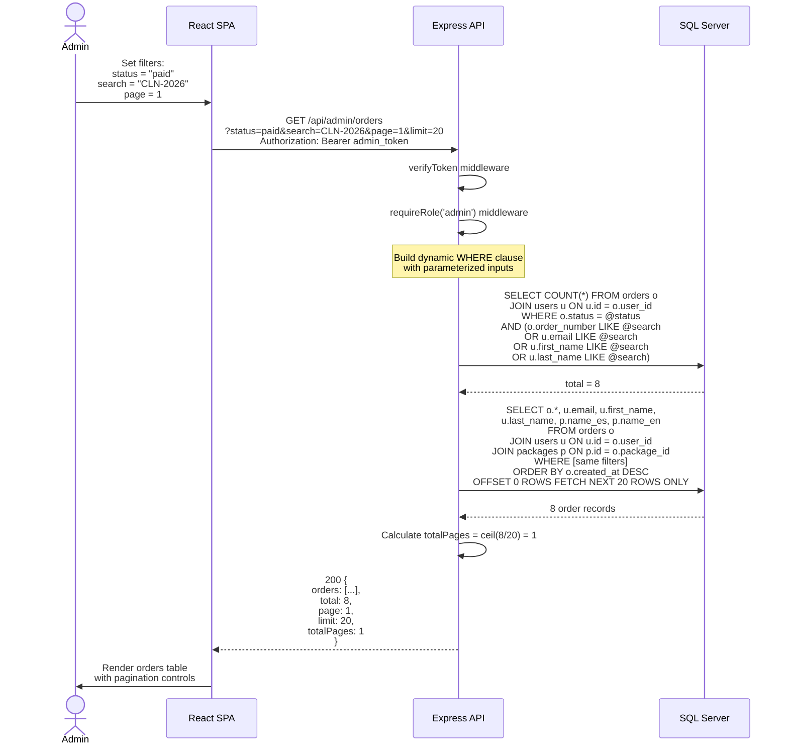
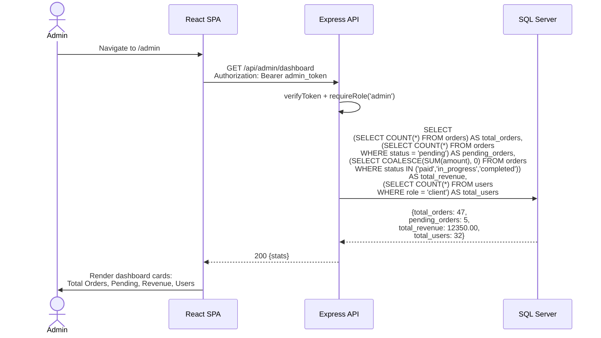

# API Sequence Diagrams

## 1. Create Order and Process Payment

```mermaid
sequenceDiagram
    actor Client
    participant Frontend as React SPA
    participant API as Express API
    participant DB as SQL Server
    participant Email as SMTP Server

    Client->>Frontend: Click "Proceed to Payment"
    Frontend->>API: POST /api/orders<br/>{packageId: 1}<br/>Authorization: Bearer token

    API->>API: verifyToken middleware
    API->>API: Validate request body

    API->>DB: SELECT * FROM packages WHERE id = @id
    DB-->>API: Package record

    alt Package not found or inactive
        API-->>Frontend: 404 "Package not found"
    end

    API->>DB: Generate order number<br/>SELECT TOP 1 order_number FROM orders<br/>WHERE order_number LIKE 'CLN-20260404-%'<br/>ORDER BY order_number DESC
    DB-->>API: Last order number (or none)
    API->>API: Calculate next: CLN-20260404-0001

    API->>DB: INSERT INTO orders<br/>(order_number, user_id, package_id, amount, currency)<br/>OUTPUT INSERTED.*
    DB-->>API: New order record

    API->>DB: INSERT INTO order_status_history<br/>(order_id, previous_status=NULL,<br/>new_status='pending', changed_by=user_id)
    DB-->>API: History record

    API-->>Frontend: 201 {order}

    Note over Frontend: MVP: Show payment simulation modal

    Client->>Frontend: Click "Simulate Successful Payment"
    Frontend->>API: POST /api/orders/10/payment-callback<br/>{success: true, paymentReference: "SIM-...",<br/>paymentMethod: "simulated"}

    API->>DB: SELECT * FROM orders WHERE id = 10
    DB-->>API: Order (status: pending)
    API->>API: Validate: order belongs to user,<br/>status is 'pending'

    API->>DB: UPDATE orders SET status='paid',<br/>payment_reference, payment_method,<br/>payment_date = GETUTCDATE()
    DB-->>API: Updated order

    API->>DB: INSERT INTO order_status_history<br/>(previous_status='pending', new_status='paid')
    DB-->>API: History record

    API->>Email: Send order confirmation to client
    API->>Email: Send new order notification to admin

    API-->>Frontend: 200 {order}
    Frontend->>Client: Show confirmation page<br/>with order number
```

## 2. Admin Changes Order Status

```mermaid
sequenceDiagram
    actor Admin
    participant Frontend as React SPA
    participant API as Express API
    participant DB as SQL Server

    Admin->>Frontend: Select new status + enter notes
    Frontend->>API: PATCH /api/admin/orders/10/status<br/>{status: "in_progress",<br/>notes: "Appointment scheduled for April 10"}<br/>Authorization: Bearer admin_token

    API->>API: verifyToken middleware
    API->>API: requireRole('admin') middleware
    API->>API: Validate request body

    API->>DB: SELECT * FROM orders WHERE id = 10<br/>JOIN users, packages
    DB-->>API: Order record (status: "paid")

    API->>API: Check VALID_TRANSITIONS["paid"]<br/>includes "in_progress"?

    alt Invalid transition
        API-->>Frontend: 400 "Invalid status transition<br/>from 'paid' to 'completed'"
        Frontend->>Admin: Show error toast
    else Valid transition
        API->>DB: UPDATE orders<br/>SET status = 'in_progress',<br/>updated_at = GETUTCDATE()<br/>OUTPUT INSERTED.*
        DB-->>API: Updated order

        API->>DB: INSERT INTO order_status_history<br/>(order_id=10,<br/>previous_status='paid',<br/>new_status='in_progress',<br/>changed_by=admin_id,<br/>notes='Appointment scheduled...')
        DB-->>API: History record

        API-->>Frontend: 200 {order}
        Frontend->>Admin: Show success toast<br/>+ update order detail view
    end
```

## 3. Admin Lists Orders with Filters

```mermaid
sequenceDiagram
    actor Admin
    participant Frontend as React SPA
    participant API as Express API
    participant DB as SQL Server

    Admin->>Frontend: Set filters:<br/>status = "paid"<br/>search = "CLN-2026"<br/>page = 1

    Frontend->>API: GET /api/admin/orders<br/>?status=paid&search=CLN-2026&page=1&limit=20<br/>Authorization: Bearer admin_token

    API->>API: verifyToken middleware
    API->>API: requireRole('admin') middleware

    Note over API: Build dynamic WHERE clause<br/>with parameterized inputs

    API->>DB: SELECT COUNT(*) FROM orders o<br/>JOIN users u ON u.id = o.user_id<br/>WHERE o.status = @status<br/>AND (o.order_number LIKE @search<br/>OR u.email LIKE @search<br/>OR u.first_name LIKE @search<br/>OR u.last_name LIKE @search)
    DB-->>API: total = 8

    API->>DB: SELECT o.*, u.email, u.first_name,<br/>u.last_name, p.name_es, p.name_en<br/>FROM orders o<br/>JOIN users u ON u.id = o.user_id<br/>JOIN packages p ON p.id = o.package_id<br/>WHERE [same filters]<br/>ORDER BY o.created_at DESC<br/>OFFSET 0 ROWS FETCH NEXT 20 ROWS ONLY
    DB-->>API: 8 order records

    API->>API: Calculate totalPages = ceil(8/20) = 1

    API-->>Frontend: 200 {<br/>  orders: [...],<br/>  total: 8,<br/>  page: 1,<br/>  limit: 20,<br/>  totalPages: 1<br/>}

    Frontend->>Admin: Render orders table<br/>with pagination controls
```

## 4. Get Admin Dashboard Statistics

```mermaid
sequenceDiagram
    actor Admin
    participant Frontend as React SPA
    participant API as Express API
    participant DB as SQL Server

    Admin->>Frontend: Navigate to /admin
    Frontend->>API: GET /api/admin/dashboard<br/>Authorization: Bearer admin_token

    API->>API: verifyToken + requireRole('admin')

    API->>DB: SELECT<br/>(SELECT COUNT(*) FROM orders) AS total_orders,<br/>(SELECT COUNT(*) FROM orders<br/>  WHERE status = 'pending') AS pending_orders,<br/>(SELECT COALESCE(SUM(amount), 0) FROM orders<br/>  WHERE status IN ('paid','in_progress','completed'))<br/>  AS total_revenue,<br/>(SELECT COUNT(*) FROM users<br/>  WHERE role = 'client') AS total_users
    DB-->>API: {total_orders: 47,<br/>pending_orders: 5,<br/>total_revenue: 12350.00,<br/>total_users: 32}

    API-->>Frontend: 200 {stats}

    Frontend->>Admin: Render dashboard cards:<br/>Total Orders, Pending, Revenue, Users
```
