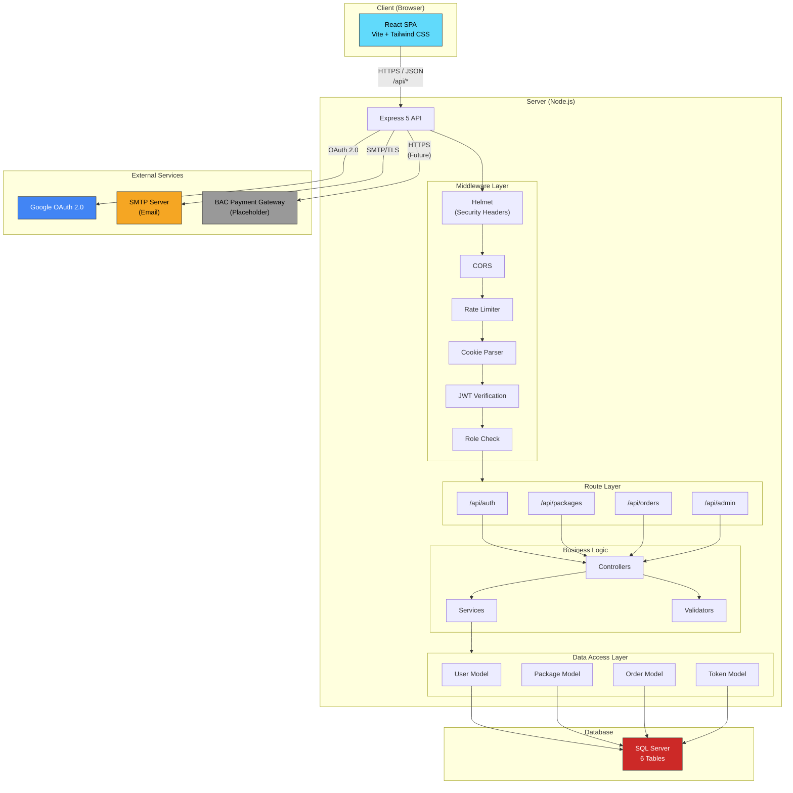

# Architecture Overview Diagram

## Description

- **React SPA**: The frontend application runs entirely in the browser. It communicates with the backend exclusively through REST API calls over HTTPS.
- **Express 5 API**: The backend server processes all API requests through a middleware pipeline before reaching route handlers.
- **Middleware Pipeline**: Every request passes through Helmet (security headers), CORS (origin validation), rate limiting, and cookie parsing. Protected routes additionally pass through JWT verification and role checking.
- **Route Layer**: Four route groups handle auth, packages, orders, and admin operations.
- **Business Logic**: Controllers parse requests and orchestrate responses. Services encapsulate multi-step business operations. Validators ensure input correctness.
- **Data Access Layer**: Four model modules encapsulate all SQL queries using parameterized inputs via the `mssql` driver.
- **SQL Server**: The database stores all persistent data across 6 tables.
- **External Services**: Google OAuth for social login, SMTP for transactional emails, and BAC payment gateway (currently a placeholder for MVP).
