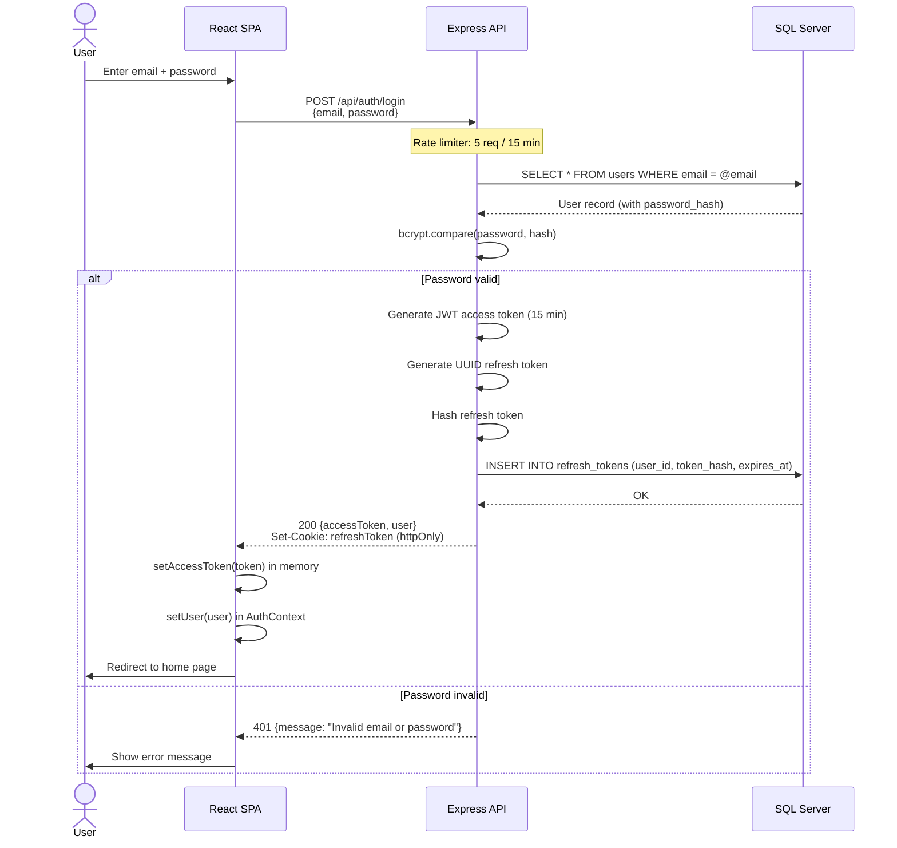
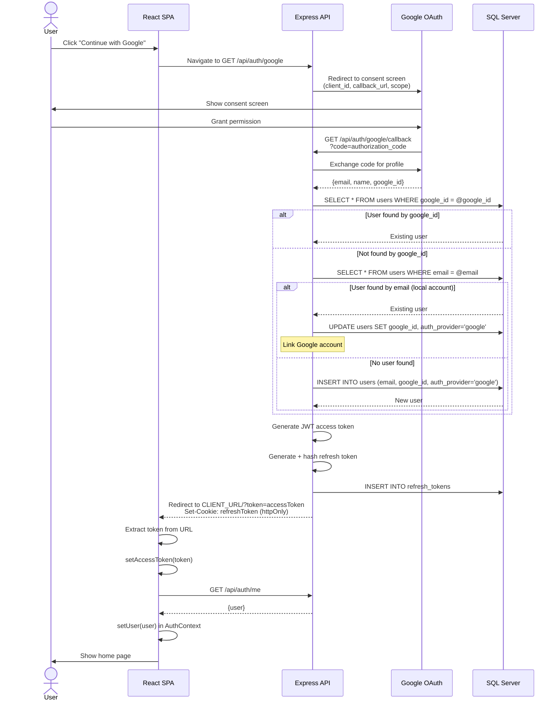
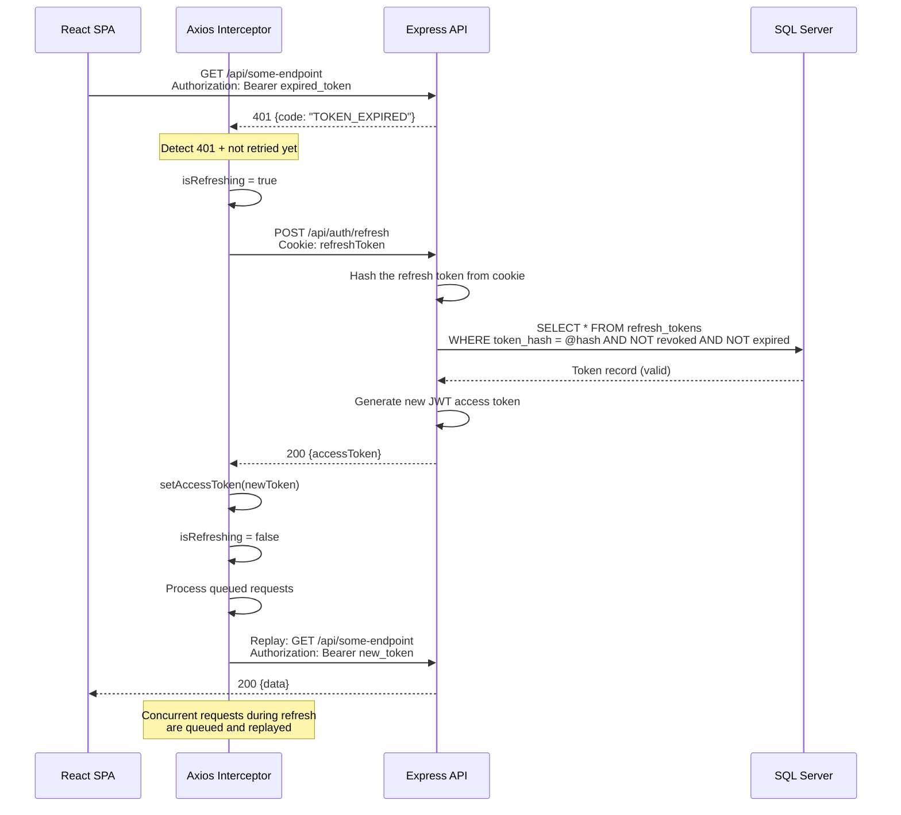
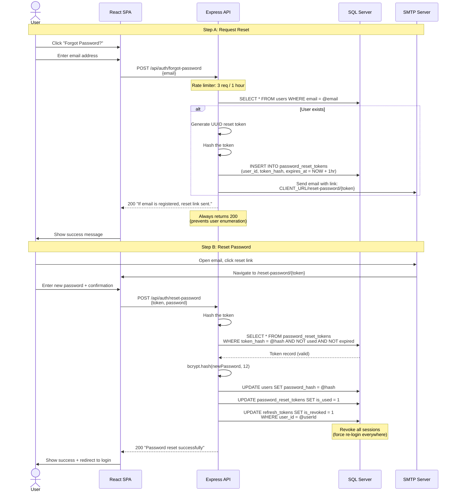
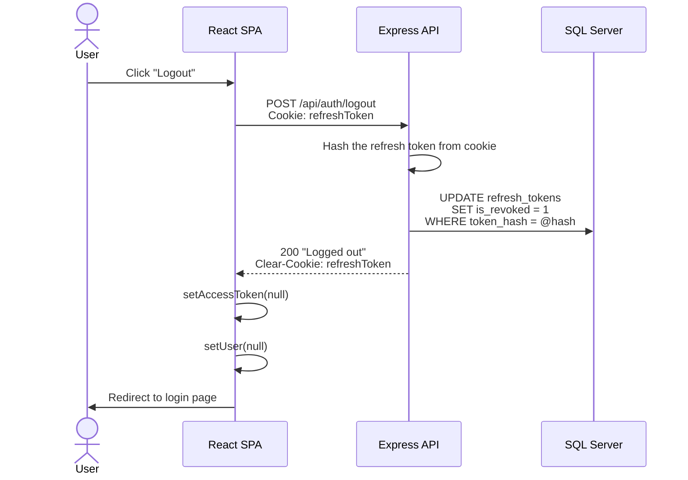

# Authentication Flow Diagrams

## 1. Local Login

```mermaid
sequenceDiagram
    actor User
    participant Frontend as React SPA
    participant API as Express API
    participant DB as SQL Server

    User->>Frontend: Enter email + password
    Frontend->>API: POST /api/auth/login<br/>{email, password}
    
    Note over API: Rate limiter: 5 req / 15 min
    
    API->>DB: SELECT * FROM users WHERE email = @email
    DB-->>API: User record (with password_hash)
    
    API->>API: bcrypt.compare(password, hash)
    
    alt Password valid
        API->>API: Generate JWT access token (15 min)
        API->>API: Generate UUID refresh token
        API->>API: Hash refresh token
        API->>DB: INSERT INTO refresh_tokens (user_id, token_hash, expires_at)
        DB-->>API: OK
        API-->>Frontend: 200 {accessToken, user}<br/>Set-Cookie: refreshToken (httpOnly)
        Frontend->>Frontend: setAccessToken(token) in memory
        Frontend->>Frontend: setUser(user) in AuthContext
        Frontend->>User: Redirect to home page
    else Password invalid
        API-->>Frontend: 401 {message: "Invalid email or password"}
        Frontend->>User: Show error message
    end
```

## 2. Google OAuth

```mermaid
sequenceDiagram
    actor User
    participant Frontend as React SPA
    participant API as Express API
    participant Google as Google OAuth
    participant DB as SQL Server

    User->>Frontend: Click "Continue with Google"
    Frontend->>API: Navigate to GET /api/auth/google
    API->>Google: Redirect to consent screen<br/>(client_id, callback_url, scope)
    Google->>User: Show consent screen
    User->>Google: Grant permission
    Google->>API: GET /api/auth/google/callback<br/>?code=authorization_code
    
    API->>Google: Exchange code for profile
    Google-->>API: {email, name, google_id}
    
    API->>DB: SELECT * FROM users WHERE google_id = @google_id
    
    alt User found by google_id
        DB-->>API: Existing user
    else Not found by google_id
        API->>DB: SELECT * FROM users WHERE email = @email
        alt User found by email (local account)
            DB-->>API: Existing user
            API->>DB: UPDATE users SET google_id, auth_provider='google'
            Note over API: Link Google account
        else No user found
            API->>DB: INSERT INTO users (email, google_id, auth_provider='google')
            DB-->>API: New user
        end
    end

    API->>API: Generate JWT access token
    API->>API: Generate + hash refresh token
    API->>DB: INSERT INTO refresh_tokens
    API-->>Frontend: Redirect to CLIENT_URL/?token=accessToken<br/>Set-Cookie: refreshToken (httpOnly)
    Frontend->>Frontend: Extract token from URL
    Frontend->>Frontend: setAccessToken(token)
    Frontend->>API: GET /api/auth/me
    API-->>Frontend: {user}
    Frontend->>Frontend: setUser(user) in AuthContext
    Frontend->>User: Show home page
```

## 3. Token Refresh (Silent)

```mermaid
sequenceDiagram
    participant Frontend as React SPA
    participant Interceptor as Axios Interceptor
    participant API as Express API
    participant DB as SQL Server

    Frontend->>API: GET /api/some-endpoint<br/>Authorization: Bearer expired_token
    API-->>Interceptor: 401 {code: "TOKEN_EXPIRED"}
    
    Note over Interceptor: Detect 401 + not retried yet

    Interceptor->>Interceptor: isRefreshing = true
    Interceptor->>API: POST /api/auth/refresh<br/>Cookie: refreshToken
    
    API->>API: Hash the refresh token from cookie
    API->>DB: SELECT * FROM refresh_tokens<br/>WHERE token_hash = @hash AND NOT revoked AND NOT expired
    DB-->>API: Token record (valid)
    API->>API: Generate new JWT access token
    API-->>Interceptor: 200 {accessToken}
    
    Interceptor->>Interceptor: setAccessToken(newToken)
    Interceptor->>Interceptor: isRefreshing = false
    Interceptor->>Interceptor: Process queued requests
    Interceptor->>API: Replay: GET /api/some-endpoint<br/>Authorization: Bearer new_token
    API-->>Frontend: 200 {data}
    
    Note over Interceptor: Concurrent requests during refresh<br/>are queued and replayed
```

## 4. Password Recovery

```mermaid
sequenceDiagram
    actor User
    participant Frontend as React SPA
    participant API as Express API
    participant DB as SQL Server
    participant Email as SMTP Server

    Note over User,Email: Step A: Request Reset

    User->>Frontend: Click "Forgot Password?"
    User->>Frontend: Enter email address
    Frontend->>API: POST /api/auth/forgot-password<br/>{email}
    
    Note over API: Rate limiter: 3 req / 1 hour
    
    API->>DB: SELECT * FROM users WHERE email = @email
    
    alt User exists
        API->>API: Generate UUID reset token
        API->>API: Hash the token
        API->>DB: INSERT INTO password_reset_tokens<br/>(user_id, token_hash, expires_at = NOW + 1hr)
        API->>Email: Send email with link:<br/>CLIENT_URL/reset-password/{token}
    end
    
    API-->>Frontend: 200 "If email is registered, reset link sent."
    Note over API: Always returns 200<br/>(prevents user enumeration)
    Frontend->>User: Show success message

    Note over User,Email: Step B: Reset Password

    User->>Email: Open email, click reset link
    Email->>Frontend: Navigate to /reset-password/{token}
    User->>Frontend: Enter new password + confirmation
    Frontend->>API: POST /api/auth/reset-password<br/>{token, password}
    
    API->>API: Hash the token
    API->>DB: SELECT * FROM password_reset_tokens<br/>WHERE token_hash = @hash AND NOT used AND NOT expired
    DB-->>API: Token record (valid)
    
    API->>API: bcrypt.hash(newPassword, 12)
    API->>DB: UPDATE users SET password_hash = @hash
    API->>DB: UPDATE password_reset_tokens SET is_used = 1
    API->>DB: UPDATE refresh_tokens SET is_revoked = 1<br/>WHERE user_id = @userId
    Note over DB: Revoke all sessions<br/>(force re-login everywhere)
    
    API-->>Frontend: 200 "Password reset successfully"
    Frontend->>User: Show success + redirect to login
```

## 5. Logout

```mermaid
sequenceDiagram
    actor User
    participant Frontend as React SPA
    participant API as Express API
    participant DB as SQL Server

    User->>Frontend: Click "Logout"
    Frontend->>API: POST /api/auth/logout<br/>Cookie: refreshToken
    
    API->>API: Hash the refresh token from cookie
    API->>DB: UPDATE refresh_tokens<br/>SET is_revoked = 1<br/>WHERE token_hash = @hash
    API-->>Frontend: 200 "Logged out"<br/>Clear-Cookie: refreshToken
    
    Frontend->>Frontend: setAccessToken(null)
    Frontend->>Frontend: setUser(null)
    Frontend->>User: Redirect to login page
```
