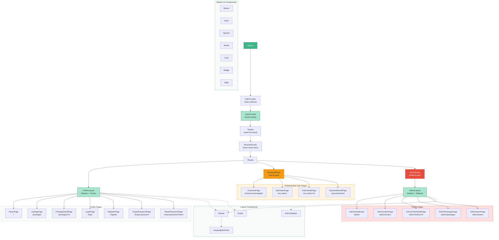

# React Component Tree

## Component Hierarchy

### Provider Chain

The application wraps the component tree with several providers, from outermost to innermost:

1. **I18nProvider** -- Initializes react-i18next with browser language detection and ES/EN translations.
2. **AuthProvider** -- Provides `user`, `isAuthenticated`, `login`, `register`, `logout`, and `refreshUser` via React Context. Restores the session on mount using the refresh token cookie.
3. **Toaster** -- react-hot-toast notifications for success/error feedback.
4. **BrowserRouter** -- React Router v7 for client-side routing.

### Route Guards

| Guard | Checks | Redirect |
| ----- | ------ | -------- |
| **ProtectedRoute** (AuthGuard) | `isAuthenticated === true` | `/login` with return URL |
| **AdminRoute** (AdminGuard) | `isAuthenticated === true` AND `user.role === 'admin'` | `/` (home) or `/login` |

### Layouts

| Layout | Contains | Used By |
| ------ | -------- | ------- |
| **PublicLayout** | Navbar + Footer | All public pages and authenticated user pages |
| **AdminLayout** | Navbar + AdminSidebar | All admin pages |

### Shared UI Components

| Component | Purpose |
| --------- | ------- |
| `Button` | Reusable button with variants (primary, secondary, danger), sizes (sm, md, lg), and loading state. |
| `Input` | Form input with label, error display, and optional icon. |
| `Spinner` | Loading spinner (Lucide `Loader2` icon with spin animation). |
| `Modal` | Dialog overlay for payment simulation and confirmations. |
| `Card` | Content container for package cards and dashboard stats. |
| `Badge` | Status badge with color-coded order statuses. |
| `Table` | Data table for admin order/user/package listings. |

### Services (Non-component)

The `services/` directory contains Axios-based API clients, not React components:

| Service | API Calls |
| ------- | --------- |
| `api.js` | Axios instance with JWT interceptors and silent token refresh. |
| `auth.service.js` | login, register, logout, refresh, forgotPassword, resetPassword, getMe, googleLogin. |
| `packages.service.js` | getActivePackages, getPackageById. |
| `orders.service.js` | createOrder, getMyOrders, getOrderById, simulatePayment. |
| `admin.service.js` | getDashboard, getOrders, getOrderDetail, updateOrderStatus, getPackages, createPackage, updatePackage, togglePackage, getUsers. |
