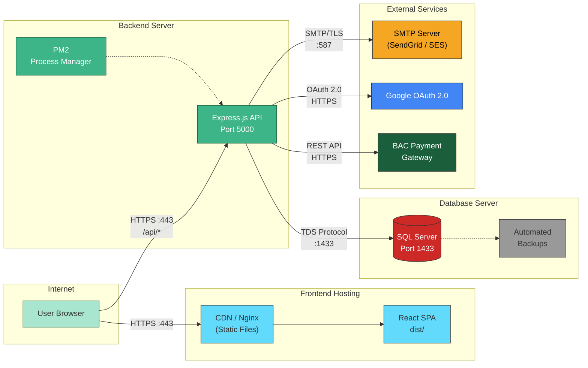
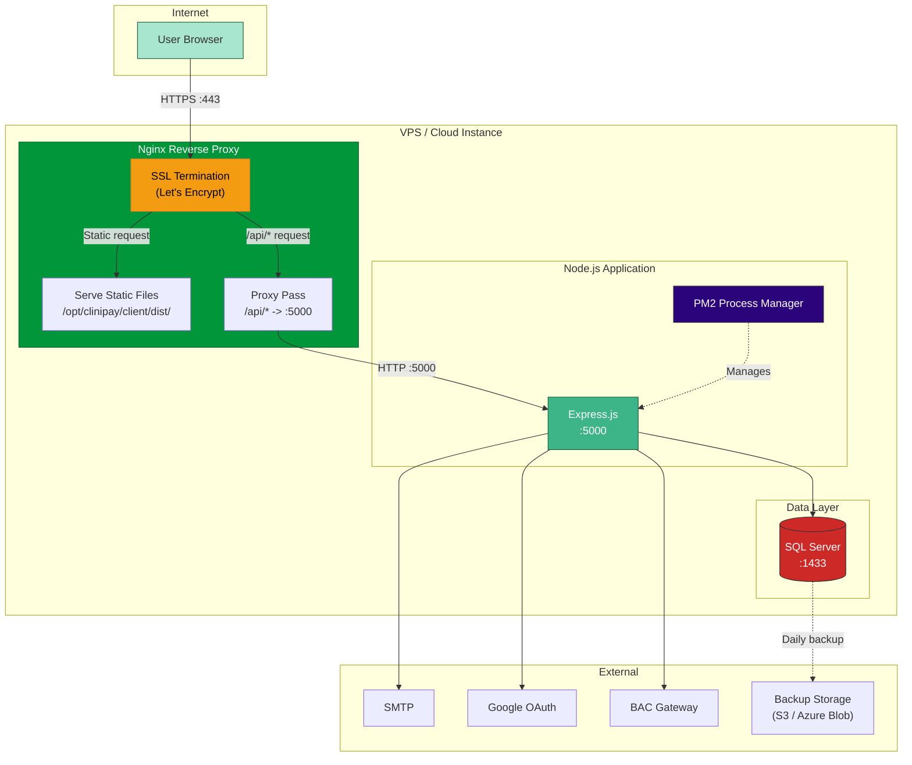
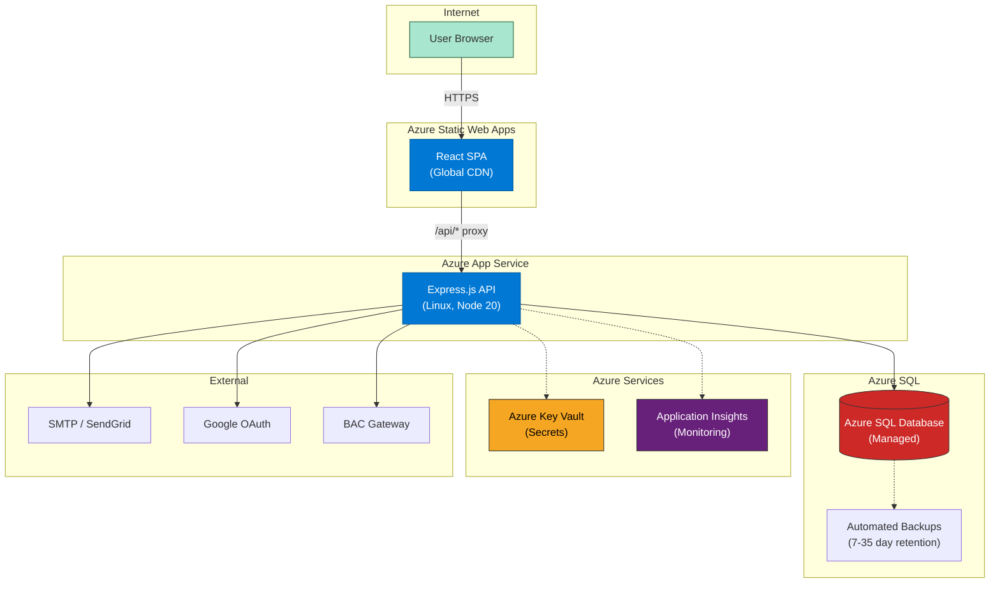

# Deployment Diagram

## Overview

## Production Setup with Nginx

## Azure Deployment

## Network & Port Summary

| Component | Port | Protocol | Direction |
| --------- | ---- | -------- | --------- |
| Nginx | 443 | HTTPS (TLS 1.2+) | Inbound from Internet |
| Nginx | 80 | HTTP (redirect to 443) | Inbound from Internet |
| Express.js | 5000 | HTTP | Inbound from Nginx only (localhost) |
| SQL Server | 1433 | TDS (encrypted) | Inbound from Express only |
| SMTP | 587 | STARTTLS | Outbound to mail provider |
| Google OAuth | 443 | HTTPS | Outbound to googleapis.com |
| BAC Gateway | 443 | HTTPS | Outbound to BAC + Inbound callback |

## Firewall Rules

| Rule | Source | Destination | Port | Action |
| ---- | ------ | ----------- | ---- | ------ |
| Allow HTTPS | 0.0.0.0/0 | Server | 443 | ALLOW |
| Allow HTTP (redirect) | 0.0.0.0/0 | Server | 80 | ALLOW |
| Allow SSH | Admin IP | Server | 22 | ALLOW |
| Block Express direct | 0.0.0.0/0 | Server | 5000 | DENY |
| Block SQL direct | 0.0.0.0/0 | Server | 1433 | DENY |
