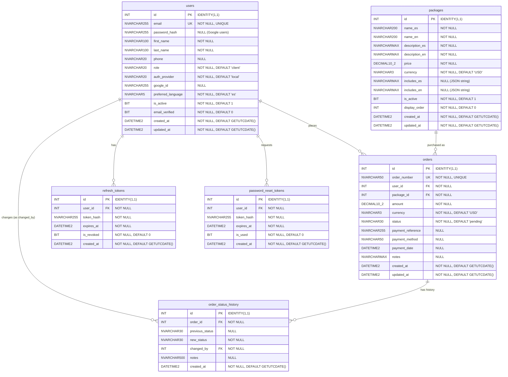

# Entity-Relationship Diagram

## Relationships

| Relationship | Cardinality | Description |
| ------------ | ----------- | ----------- |
| `users` -> `orders` | One-to-Many | A user can place many orders. Each order belongs to one user. |
| `packages` -> `orders` | One-to-Many | A package can appear in many orders. Each order references one package. |
| `orders` -> `order_status_history` | One-to-Many | An order has many status change records forming an audit trail. |
| `users` -> `order_status_history` | One-to-Many | A user (admin or system) makes status changes. Each record tracks who changed it. |
| `users` -> `refresh_tokens` | One-to-Many | A user can have multiple active refresh tokens (e.g., multiple devices). |
| `users` -> `password_reset_tokens` | One-to-Many | A user can request multiple password resets. Only the latest unused, non-expired token is valid. |

## Notes

- `includes_es` and `includes_en` in `packages` store JSON arrays as `NVARCHAR(MAX)` strings (e.g., `'["item1","item2"]'`).
- `order_number` follows the format `CLN-YYYYMMDD-NNNN` and is unique across all orders.
- `status` in `orders` is constrained by application logic to: `pending`, `paid`, `in_progress`, `completed`, `cancelled`.
- Token tables store only hashed values -- never plaintext tokens.
- `password_hash` in `users` is `NULL` for Google-only users who have never set a local password.
