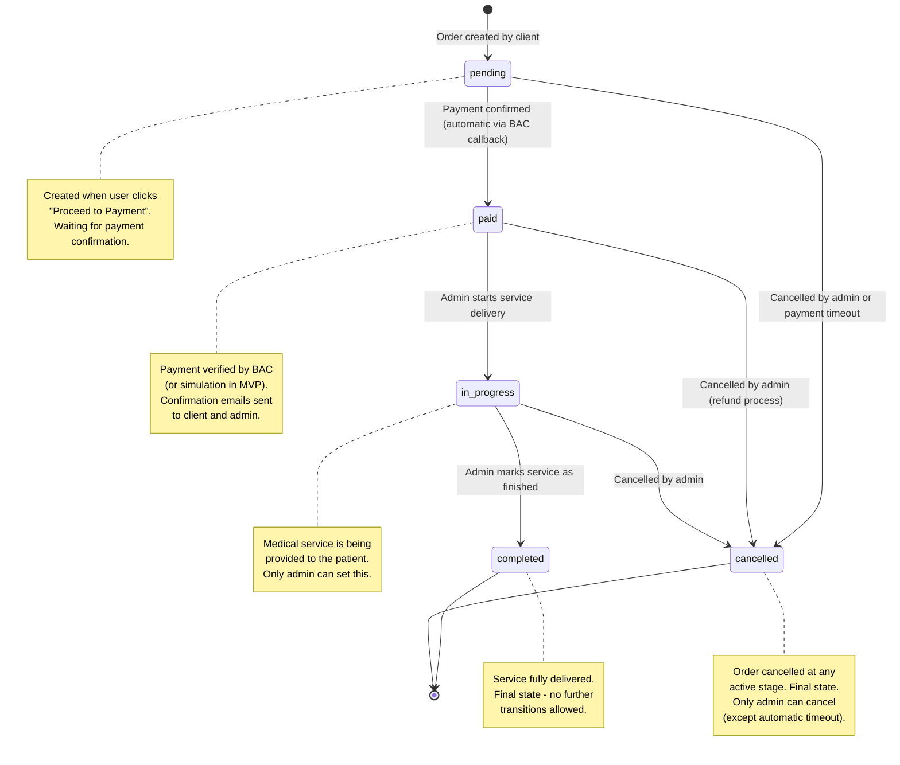

# Order State Diagram



## Transition Rules

| From | To | Triggered By | Automatic? | Notes |
| ---- | -- | ------------ | ---------- | ----- |
| `pending` | `paid` | BAC payment callback / simulation | Yes | Payment reference, method, and date are recorded on the order. |
| `pending` | `cancelled` | Admin action / payment timeout | Manual | Admin provides cancellation reason in notes. |
| `paid` | `in_progress` | Admin action | Manual | Admin confirms the medical service has begun. |
| `paid` | `cancelled` | Admin action | Manual | Refund process should be initiated externally. |
| `in_progress` | `completed` | Admin action | Manual | Final delivery confirmed. |
| `in_progress` | `cancelled` | Admin action | Manual | Partial service situations documented in notes. |
| `completed` | *(none)* | -- | -- | Terminal state. No further transitions. |
| `cancelled` | *(none)* | -- | -- | Terminal state. No further transitions. |

## Implementation Details

### Server-Side Validation

The valid transitions are defined in `server/src/config/constants.js`:

```javascript
const VALID_TRANSITIONS = {
  pending:     ['paid', 'cancelled'],
  paid:        ['in_progress', 'cancelled'],
  in_progress: ['completed', 'cancelled'],
  completed:   [],
  cancelled:   [],
};
```

Before any status update, the controller checks:
1. The order exists.
2. The new status is in `VALID_TRANSITIONS[currentStatus]`.
3. If invalid, a 400 error is returned.

### Audit Trail

Every transition is recorded in the `order_status_history` table with:
- `previous_status` -- the status before the change.
- `new_status` -- the status after the change.
- `changed_by` -- the user (admin or system) who made the change.
- `notes` -- optional explanation (e.g., "Patient appointment scheduled for April 10").
- `created_at` -- UTC timestamp.

### Client-Side Display

The frontend maps each status to a display label and color:

| Status | Spanish Label | English Label | Color |
| ------ | ------------- | ------------- | ----- |
| `pending` | Pendiente de Pago | Pending Payment | Warning (amber) |
| `paid` | Pagado | Paid | Blue |
| `in_progress` | En Progreso | In Progress | Purple |
| `completed` | Completado | Completed | Success (green) |
| `cancelled` | Cancelado | Cancelled | Error (red) |
