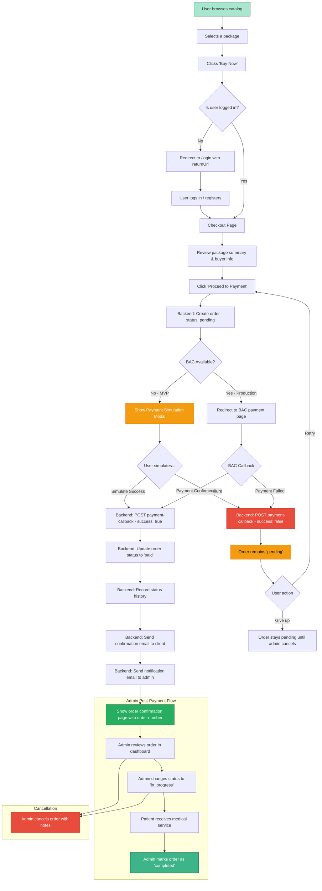

# Purchase Flow

## Flow Summary

### Happy Path

1. User browses the catalog and selects a package.
2. User clicks "Buy Now" -- if not logged in, redirected to login first.
3. User reviews package details and buyer information on the checkout page.
4. User clicks "Proceed to Payment."
5. Backend creates an order with status `pending`.
6. Payment is processed (simulated in MVP, BAC redirect in production).
7. On success, order status becomes `paid`.
8. Confirmation emails are sent to the client and admin.
9. User sees the order confirmation page.
10. Admin later moves the order through `in_progress` to `completed`.

### Failure Path

1. If payment fails, the order stays in `pending` status.
2. The user can retry the payment from the order detail page.
3. If the user abandons, the admin can manually cancel the order.

### Edge Cases

- **Browser closes during payment**: Order is already created as `pending`. User can find it in "My Orders" and retry.
- **Payment gateway timeout**: Order stays `pending`. BAC may send a delayed callback for production.
- **Double order**: Each "Proceed to Payment" creates a new order. Duplicate orders can be cancelled by admin.
